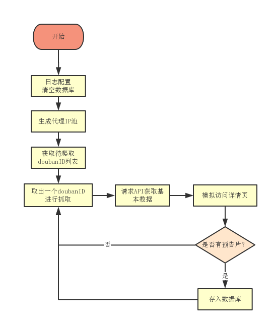
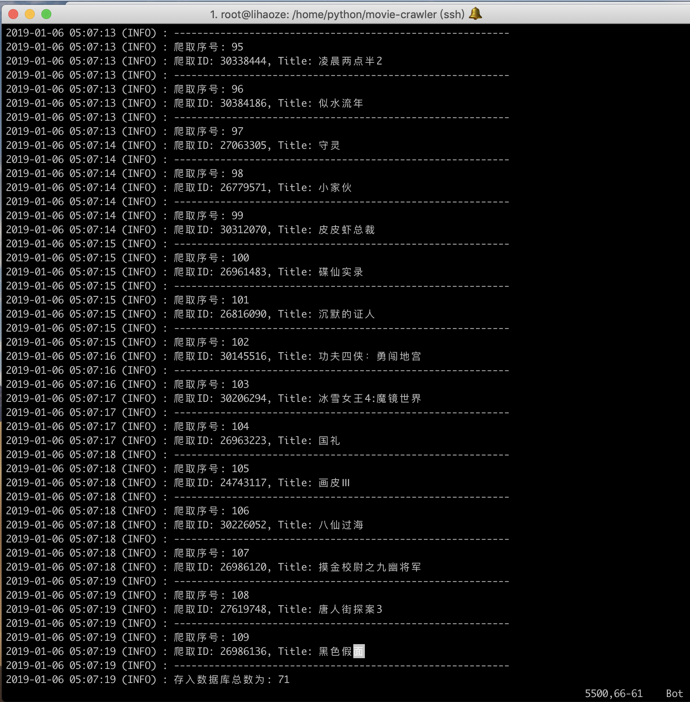

# Python爬取豆瓣热映与即将上映的电影信息及预告片

> 利用python去抓取豆瓣页面doubanID数组，并通过请求电影API、模拟访问详情页获取所需要的信息，存入MongoDB数据库。用于[movie-api](https://github.com/lhz960904/movie-api)使用。项目部署到服务器并通过crontab每日定时执行。

### 爬取URL

- **正在热映**：https://movie.douban.com/cinema/nowplaying/
- **即将上映**：https://movie.douban.com/coming

- **电影API**：http://api.douban.com/v2/movie/${doubanId}
- **详情页**：https://movie.douban.com/subject/${doubanId}

### 爬取流程图


### 定时任务命令

```shell
# 每天凌晨5点执行python3 crawler.py。并将控制台错误输入到error.txt文件里
0 5 * * * /usr/bin/python3 /home/python/movie-crawler/crawler.py 2> /home/python/error.txt  &
```

### log截图



